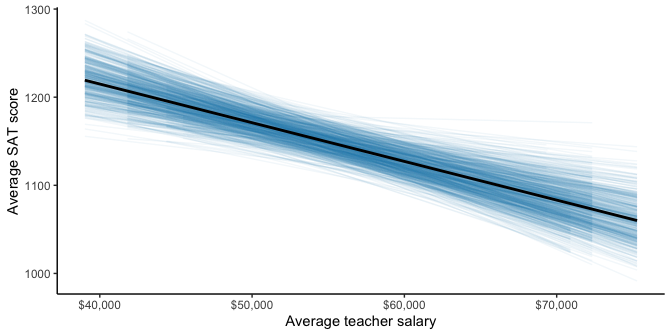
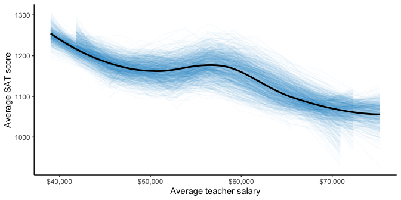
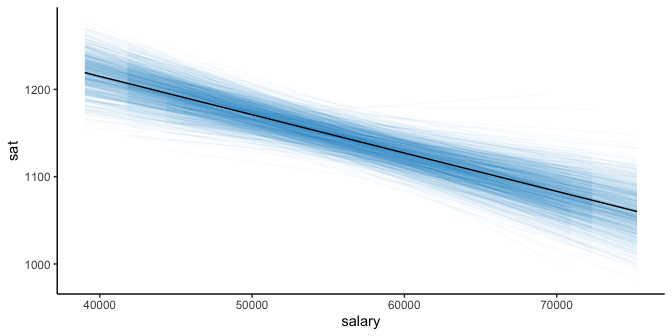
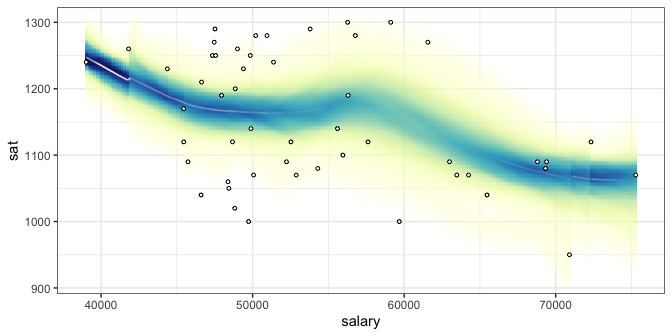

<!-- README.md is generated from README.Rmd. Please edit that file -->

# educate

Miscellaneous R functions for educational statistics

This package is meant to provide helpful functions for data analysis in
educational statistics.

## Installation

``` r
devtools::install_github("zief0002/educate")
```

## Watercolor Smoother

The `watercolor_smoother()`, `watercolor_smoother_felix()` and
`stat_watercolor_smooth()` functions generate smoothers from
bootstrapped samples. The first two functions are stand-alone functions
that create ggplot objects (no ggplot syntax required). The third
function can be used as a layer directly in ggplot.

### stat\_watercolor\_smooth()

``` r
# Load libraries
library(ggplot2)
library(scales)
library(educate)

ggplot(data = education, aes(x = salary, y = sat)) +
  stat_watercolor_smooth(method = "lm") +
  geom_smooth(method = "lm", se = FALSE, color = "black") +
  theme_classic() +
  scale_x_continuous(name = "Average teacher salary", labels = dollar) +
  ylab("Average SAT score")
```

<!-- -->

The figure shows average SAT score plotted as a function of average
teacher salaries. The OLS regression line (black) and regression lines
for 700 bootstrapped samples (blue) are also displayed. If no method is
specified, or `method="loess` is used, the functions will fit a loess
smoother. That is demonstrated below along with showing how to change
the `k=` and `alpha=` arguments. (Note if the sample size is large and
no method is specified a GAM model will be fitted.)

``` r
ggplot(data = education, aes(x = salary, y = sat)) +
  stat_watercolor_smooth(k = 1000, alpha = 0.03) +
  geom_smooth(se = FALSE, color = "black") +
  theme_classic() +
  scale_x_continuous(name = "Average teacher salary", labels = dollar) +
  ylab("Average SAT score")
```

<!-- -->

### watercolor\_smoother

Essentially the same plot can be obtained using the
`watercolor_smoother()` function which is not embedded as a ggplot
layer. The difference is the default number of bootstrap samples is
`k=1,000` (rather than `k=700`) and the default alpha level is
`alpha=0.03` (rather than
`alpha=0.06`).

``` r
watercolor_smoother(data = education, x = salary, y = sat, method = "lm")
```

<!-- -->

### watercolor\_smoother\_felix()

This function implements code written by [Felix
Schonbrodt](https://www.nicebread.de/visually-weighted-watercolor-plots-new-variants-please-vote/)
and also allows for a multicolor palette to be used rather than a
moncolor palette. WHile this is pretty, it may not be any more
interpretive than the monocolored palette. (Note: This functionality is
not currently implemented in `stat_watercolor_density()` nor
`watercolor_smoother()`.)

``` r
watercolor_smoother_felix(formula = sat~salary, data = education, show.points = TRUE)
```

<!-- -->

###
